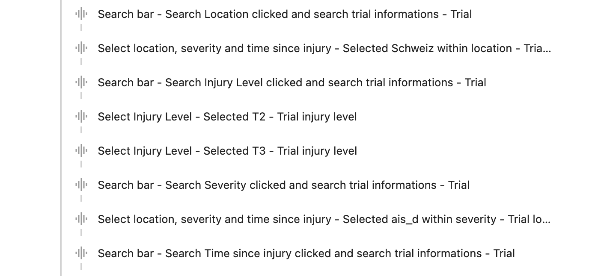
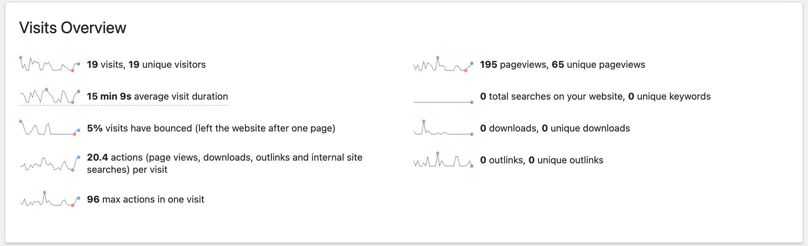

# Matomo Analytics with React

🦋 Matomo Analytice is Google Analytics alternative that protects your data and your customers' privacy, it is a powerful web analytics platform that gives you 100% data ownership.

- **Example 1**, if you want to tracking on mounting of react component at every render, just embedding the following on each of the pages which you want to track:

```jsx
// Trigger pageview tracking on mounting of React component
const registerPageLoad = () => {
	const _paq = window._paq || [];
	_paq.push(['trackPageView']);
};

useEffect(() => {
	registerPageLoad();
}, []);
```

- **Example 2**, if you want to tracking if the form submit successful or not, you can add similar like below on each event trigger which you want to track:

```jsx
// Trigger an event tracking on submit button click
onValidate: ...
onSubmit: async (values, errors) => {
      const _paq = window._paq || [];
      if (!errors) {
        _paq.push([
          'trackEvent',
          'Notify me Button',
          `Email sent`,
          `Notify me`,
        ]);
      }
      try {
        await Client.notifications.post(values);
      } catch (e) {
        throw errors;
      }
      successDialog.toggle();
    },
  });
  ... other code
```

<hr />

## Example Screenshots from one of my company project: 👇

- Select and Search button click event tracking:



- An Overview of the page visits:



<hr />

🍭🍭 Because our project was based on Gatsby, so we used gatsby-plugin-matomo:

👉 You should be able to test the analytics also locally, but only if you create a production build. In dev, matomo is disabled by default (this is handled by gatsby-plugin-matomo)

<hr />

👉 If it’s not possible to set up the events from the matomo UI, try directly sending an event via javascript, for example when the user opens/submits the overlay:

Hier is a guide about how to set up matomo-event-tracking with javascript: ( If the project is based on React, you can use Hooks, add event trigger into your code... like the examples above ): 🌸
https://matomo.org/docs/event-tracking/#how-to-set-up-matomo-event-tracking-with-javascript
