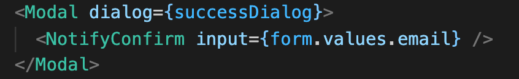
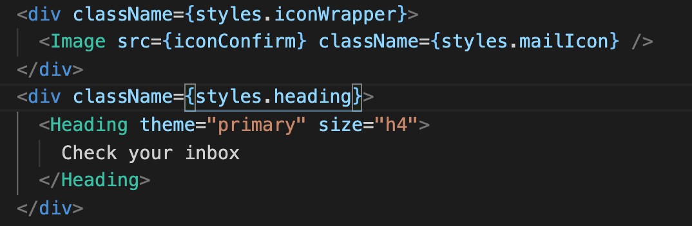
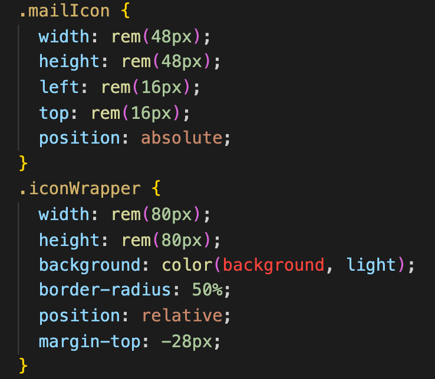
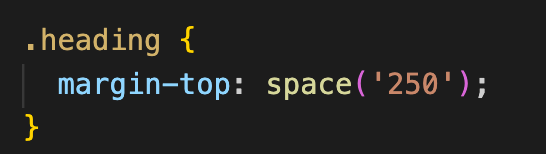

# Prevent background-color cut in case of negative margin

This is the problem which I faced in my current project:

I have an Overlay which is a Modal Component:

This Modal contains 2 Components:

- `Header` component with a close icon;
- `NotifyConfirm` Component which contains rest

It should look like this below:

This is the `NotifyConfirm` Component heading which contains the `mailIcon` with lightgrey background color and a `title`

And the `Header` component contains only the `close` icon at top right

The Problem hier is:
The `mailIcon` should be aligned to the `closeIcon`, but they are in the different components and with negative `margin-top`, it looks like this below:

With `position: relative` on `ìconWrapper` and `position: absolute` on `mailIcon`, I can center the `mailIcon`, but the wrapper background color is not complete because of the negative margin

So I tried to use `z-index`, but for some position reason it doesn't work, maybe it should work but I didn't find the solution.

Hier is what I did:

I changed the position for `ìconWrapper` from `relative` to `absolute`, so that the background color can be complete

and give the `Heading` (title) a `margin-top` to push the content down to the icon wrapper

And that's it!
