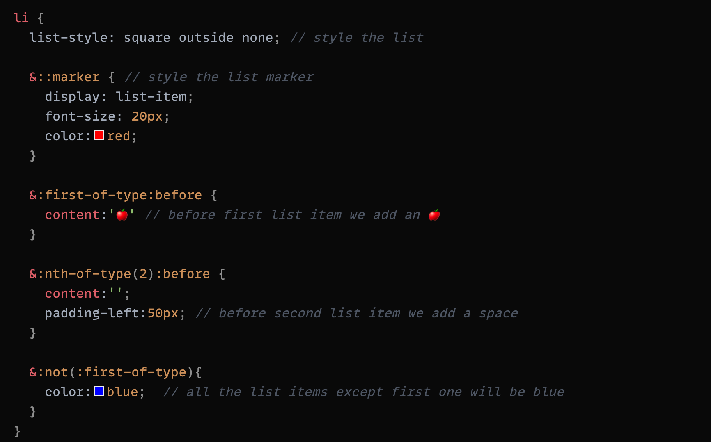
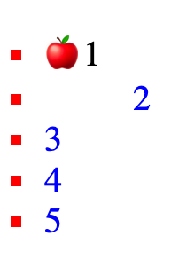

# Change the list style

I recently had a tricky situation that I had to give my list (`<ul>..<li>`) a new styling like changing color, adding space between the marker and text ...

🍉 Below is my solution, maybe there is a better way to do it, but here is what I did:

🥭 and the Result:

`some of those use cases above`
