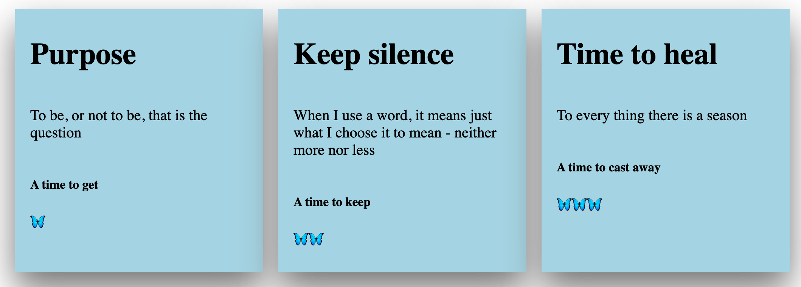
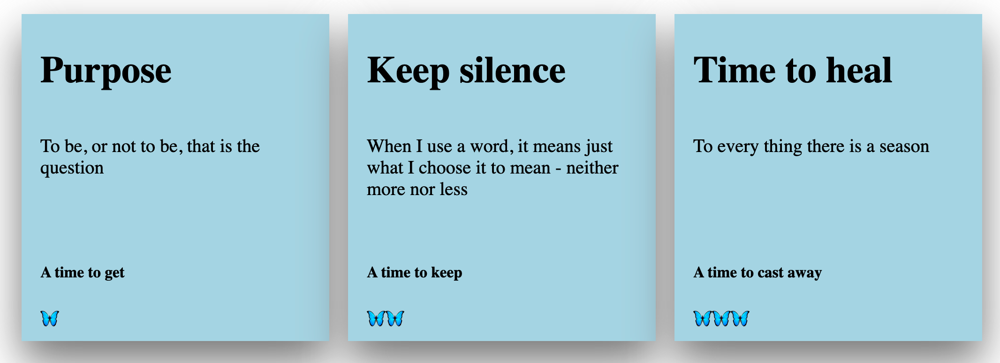

# Keep the contents of a container at the bottom

Suppose there are many cards in a page, the number of rows on the page is not fixed, but there are fixed 3 cards in each row, and all cards are the same height and width.

```jsx
// Card Items mock Data
const cardItems = [
	{
		id: 1,
		title: 'Purpose',
		text: 'To be, or not to be, that is the question',
		subtext: 'A time to get',
		icon: '🦋',
	},
	{
		id: 2,
		title: 'Keep silence',
		text: 'When I use a word, it means just what I choose it to mean - neither more nor less',
		subtext: 'A time to keep',
		icon: '🦋🦋',
	},
	{
		id: 3,
		title: 'Time to heal',
		text: 'To every thing there is a season',
		subtext: 'A time to cast away',
		icon: '🦋🦋🦋',
	},
];
```

Card component:

```jsx
// ... others
return (
	<div className="cardsContainer">
		{cardItems.map((item) => (
			<div className="card" key={item.id}>
				<h1>{item.title}</h1>
				<p>{item.text}</p>
				<div className="bottomWrapper">
					<h5>{item.subtext}</h5>
					{item.icon}
				</div>
			</div>
		))}
	</div>
);
```

```jsx
// ClassName cardsContainer and grid layout make the 3 cards exist in one row with space ( gap and margin ) around and between them
.cardsContainer {
  display: grid;
  grid-template-columns: repeat(3, 1fr);
  gap: 1rem;
  margin: 1rem;
}
```

Result: 👇



Each card has a different content height 💥

`But this is needed: the spacing from the icon to the card bottom should always be the same, no matter how many lines the text content occupies, like this below:`
👇



<br />

```jsx
// Add Flexbox on card is correct, but still doesn't really resolve the problem:
.card {
  display: flex;
  flex-direction: column;
  padding: 0.5rem 1rem;
  box-shadow: 0px 22px 45px gray;
  background-color: lightblue;
}
```

Add this to solve the problem:

```jsx
// margin-top pushs the items to the bottom
.bottomWrapper {
  margin-top: auto;
}
```

With `margin auto` we can control not only the `horizontal` but also `vertical` alignment of a specific element.

\*\* Margin adds space to the element, with **margin-top:auto**, the auto calculates the entire available space and makes that space to the top of the element, in our case it pushes the element ( subtext and icon wrapper ) all the way to the bottom.

👉 One thing to mention: The parent element ( card in our case ) should always use Flexbox properties.
