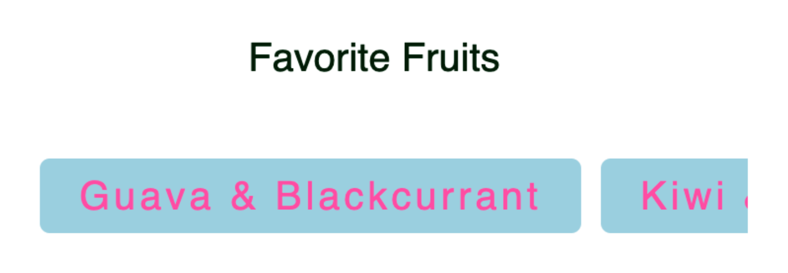
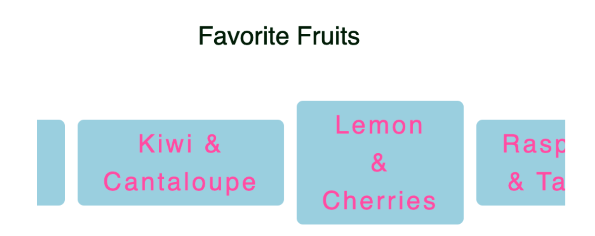

# Horizontal scrolling lists on mobile devices

Sometimes it is necessary to make a horizontal scrolling effect for the list on mobile devices, which is actually convenient and can be achieved with CSS.

```jsx
// list mock Data
const fruits = [
	{ name: 'Guava & Blackcurrant', id: 1 },
	{ name: 'Kiwi & Cantaloupe', id: 2 },
	{ name: 'Lemon & Cherries', id: 3 },
	{ name: 'Raspberries & Tamarind', id: 4 },
	{ name: 'Blueberries & Watermelon', id: 5 },
];
```

render list as tags:

```jsx
// ... others
<header className={styles.title}>Favorite Fruits </header>
      <div className={styles.tags}>
        {fruits.map(({ name, id }) => (
          <div className={styles.tag} key={id}>
            {name}
          </div>
        ))}
</div>
```

CSS:

```jsx
.tags {
  display: flex;
  align-items: center;
  margin: 2rem 0;
  padding: 0 1rem;
  justify-content: center;
  /* horizontal scrolling */
  overflow-x: scroll;

  @media(min-width: 481px){
    overflow: visible;
    flex-wrap: wrap;
    justify-content: center;
    padding:0;
  }
}

.tag {
  background-color: lightblue;
  border: 0;
  border-radius: 5px;
  color: hotpink;
  font-size: 1rem;
  letter-spacing: 2px;
  line-height: 1.5rem;
  padding: 4px 1rem;
  margin-right: 0.5rem;
  margin-bottom: 0.5rem;
  /* fix tag height */
  flex:none;

  @media(min-width: 481px){
    z-index:1;
    flex-grow: 1;
    max-width:fit-content;
  }
}
```

Result Desktop: 👇


Mobile:



using

```jsx
flex: none;
```

to fix tags heights



<hr />

To hide or customize the scrollbar:

```jsx
::-webkit-scrollbar {
display: none;
}

::-webkit-scrollbar-track{
border-radius: ...;
-webkit-box-shadow: ...;
}
::-webkit-scrollbar-thumb:hover {
background-color: ...;
-webkit-box-shadow: ...;
}
```

But many UI designers believe that “standardized” UI components like scrollbars should never be interfered with performance 🧊

**::-webkit-scrollbar** only works on Blink and WebKit based browsers (e.g Chrome, Edge, Opera, Safari, all browsers on iOS…), but not Firefox, Internet Explorer, Firefox for Android. If overflow: scroll not set, no scroll bar is displayed.
