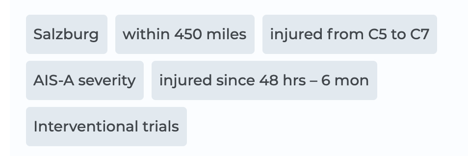

# Prevent line break

✨ If you have something like below to display, and those items are not `<li>`s inside `<ul>`, instead `<span>`s, because they should beside each other.

🤞 I created scss file like below, it prevents the line break for each `<li>` and it's also possible to define `padding` and `margin` ... ( ignore the scss modules there )



```jsx
.selectedItem {
background: $color-gray-15;
border-radius: rem(4px);
margin-right: space('50');
padding: space('25') space('50');
line-height: 2rem;
color: $color-gray-70;
font-weight: 500;

// below are important
overflow: hidden;
text-overflow: ellipsis;
display: inline-block;
white-space: nowrap;
}
```

That's it! 🎃
