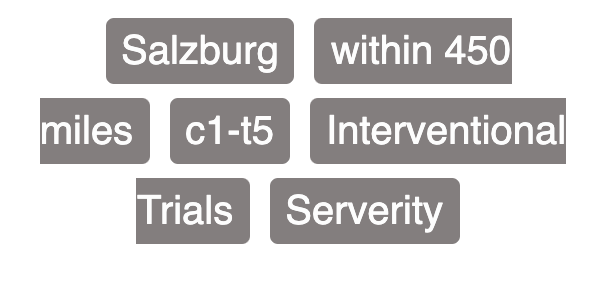

# Prevent line break

✨ If you have something like below to display, and those items are inline `<span>`s beside each other


Let's say you map the lists 👇

```jsx
{
	lists.map((list) => {
		return (
			<span className="selectedItem" key={list.id}>
				{list.text}
			</span>
		);
	});
}
```

and give them some styles 👇

```jsx
.selectedItem {
background: $color-gray-15;
border-radius: rem(4px);
margin-right: space('50');
padding: space('25') space('50');
line-height: 2rem;
color: $color-gray-70;
font-weight: 500;
}
```

You will get something like this below 👇



see the line breaks? 🧩

🤞 To prevent line break, I created scss file like below, it prevents the line break for each `<span>` and it's also possible to define `padding` and `margin` ... ( ignore the scss modules )

```jsx
.selectedItem {
background: $color-gray-15;
border-radius: rem(4px);
margin-right: space('50');
padding: space('25') space('50');
line-height: 2rem;
color: $color-gray-70;
font-weight: 500;

// below are important
overflow: hidden;
text-overflow: ellipsis;
display: inline-block;
white-space: nowrap;
}
```

That's it! 🎃
