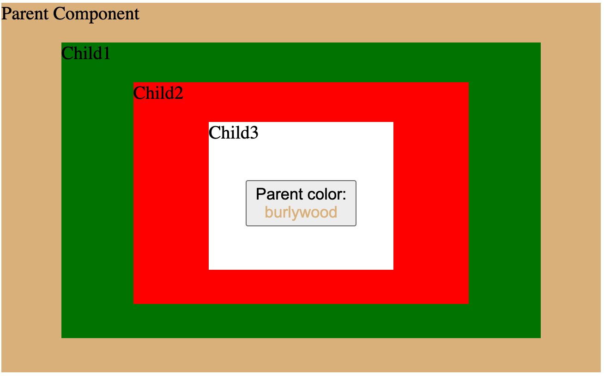
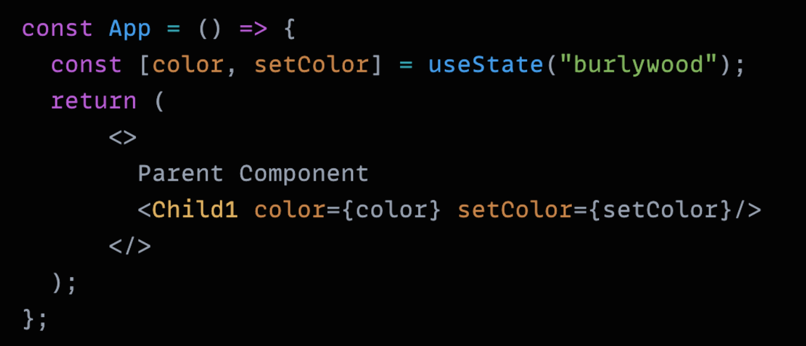
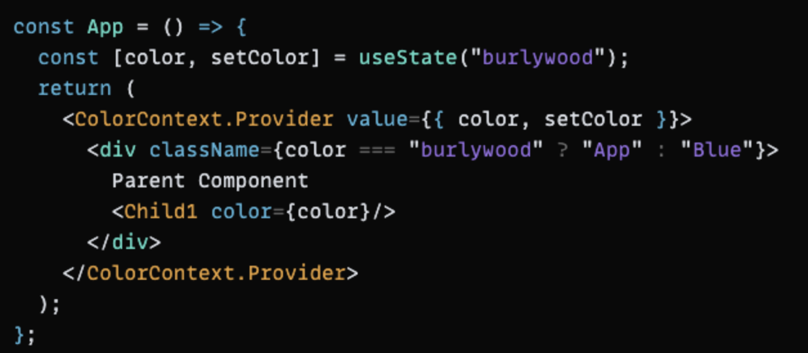
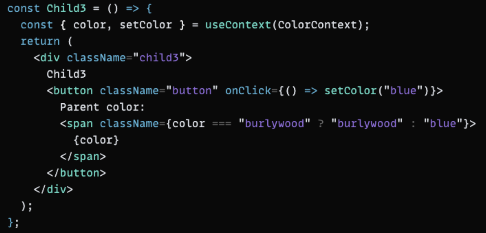
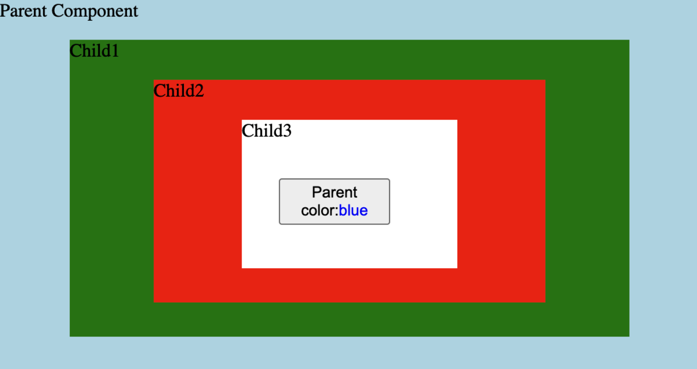

# Update parent state from child component with React Context api

In React, state and props are two very important properties and are commonly used

Suppose the parent component has three nested child components.



Inside the Child3 component, a button shows what color the parent component has: the initial color is _Burlywood_. In order to change the parent color with this button, we could just pass the color props through all the child components down to Child3 and use the **onClick** event to update the parent color:



But what if we have 10 nested child components or more?
In this case, we could use a React Hook: **useContext**

<hr />
<br />

1, create a Context inside parent component and wrap the returned value inside a Provider:

```jsx
const ColorContext = createContext();
```

_To make this context module useful, we need to use a **Provider** and provide a value with a component, the Provider Component is used to provide context to its child components, no matter how deep they are_

👉 The important thing here is that all components that want to use the context later must be wrapped in this provider component, if you want to change the context value, just update the value prop



<br />

2, I recommend to use the **useContext(Context)** React hook, it returns the value of the context: **value = useContext(Context)**.

In this case, we can use the context value in the Child3 component like this below:

```jsx
const { color, setColor } = useContext(ColorContext);
```

<br />

3, As a final step, update the color of the parent component with a button onClick function. In this simple example, we just set the color to “blue”:



Now when we click the button, the background color of the parent component will change to blue ✨



<hr />

The main idea of using context is to allow components to access some global data and re-render when the global data changes. Context solves the prop drilling problem: when you have to pass props from parent to a lot of child components.

👉 On the other hand, integrating context adds complexity. Create context, wrap everything in provider, useContext() in each consumer — this adds complexity and makes it harder to unit test components.
