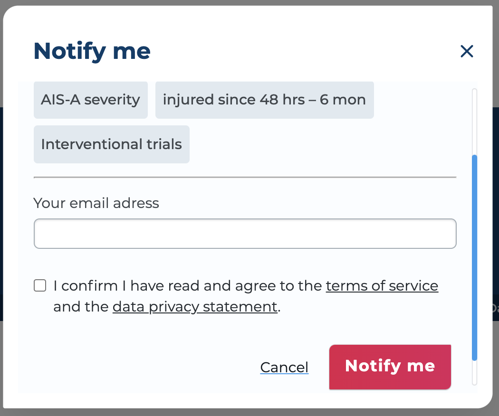
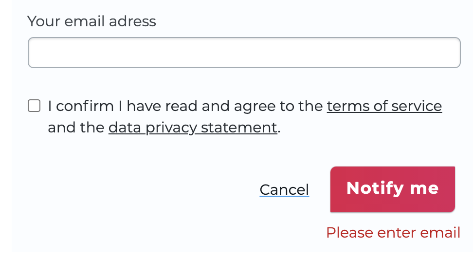
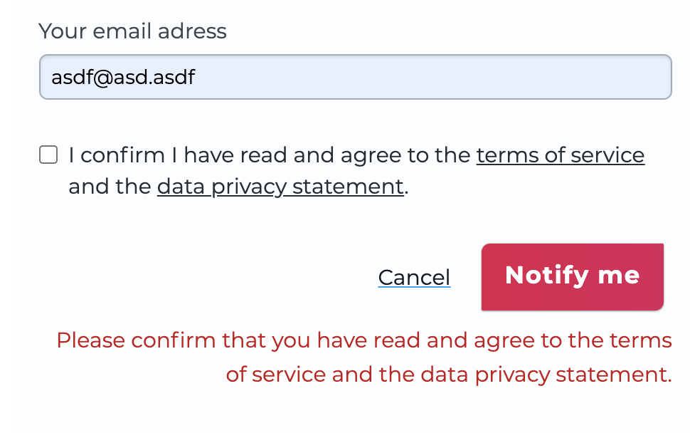
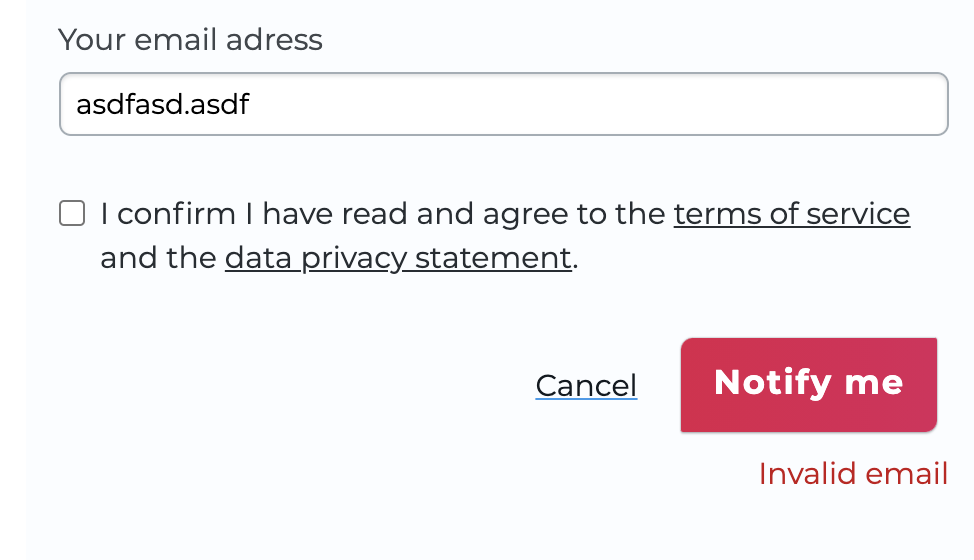

# Email validation with Dialog

In one of my current projects, I created an overlay where the user can
input email addresses and submit, 🧊 I'm using `reakit` Dialog which is one
of my favorite, and created email validation within it.

💫 It validates 3 different situations weather the user "input nothing",
"input invalid email ", "not confirm the checkbox"

```jsx
import styles from 'components/NotifyOverlay/NotifyOverlay.module.scss';
import NotifyConfirm from 'components/NotifyConfirm/NotifyConfirm';

import React, { useState } from 'react';
import { Separator } from 'reakit/Separator';
import { useDialogState, DialogDisclosure } from 'reakit/Dialog';

import Form, { Field } from 'ui/src/components/Form/Form';
import Link from 'ui/src/components/Link/Link';
import Button from 'ui/src/components/Button/Button';
import Modal from 'ui/src/components/Modal/Modal';

import { Checkbox, useCheckboxState } from 'reakit/Checkbox';

const NotifyOverlay = () => {
	const checkbox = useCheckboxState({ state: true });
	const [checked, setChecked] = useState(false);
	const toggle = () => setChecked(!checked);
	const dialog = useDialogState();

	const [input, setInput] = useState('');
	const [errorMessage, setErrorMessage] = useState('');

	// email validation with regex
	const emailValidation = () => {
		let isValid = true;
		const pattern = new RegExp(
			/^(("[\w-\s]+")|([\w-]+(?:\.[\w-]+)*)|("[\w-\s]+")([\w-]+(?:\.[\w-]+)*))(@((?:[\w-]+\.)*\w[\w-]{0,66})\.([a-z]{2,6}(?:\.[a-z]
			{2})?)$)|(@\[?((25[0-5]\.|2[0-4][0-9]\.|1[0-9]{2}\.|[0-9]{1,2}\.))((25[0-5]|2[0-4][0-9]|1[0-9]{2}|[0-9]
			{1,2})\.){2}(25[0-5]|2[0-4][0-9]|1[0-9]{2}|[0-9]{1,2})\]?$)/i,
		);

		if (typeof input !== 'undefined') {
			if (!pattern.test(input)) {
				isValid = false;
				setErrorMessage('Invalid email');
			}
			if (checked === false && pattern.test(input)) {
				isValid = false;

				setErrorMessage(
					'Please confirm that you have read and agree to the terms of service and the data privacy statement.',
				);
			}
		}

		if (!input) {
			isValid = false;
			setErrorMessage('Please enter email');
		}

		return isValid;
	};

	const handleSubmit = () => {
		if (emailValidation()) {
			setErrorMessage('');
		}
	};

	const mockSelected = ['Interventional trials', '...', '...'];

	return (
		<>
			<div>
				{mockSelected.map((item) => {
					return <li className={styles.selectedItem}>{item}</li>;
				})}
			</div>
			<Separator />
			<Form className={styles.inputWrapper}>
				<Field
					isNotify
					className="..."
					name="titel"
					label="Your email"
					onChange={(e) => setInput(e.target.value)}
				/>
			</Form>
			<div className={styles.confirmWrapper}>
				<label>
					<Checkbox
						value=""
						checked={checked}
						onChange={toggle}
						{...checkbox}
						className={styles.checkbox}
					/>
				</label>
				<p className={styles.confirmText}>
					I confirm I have read and agree to the{' '}
					<Link className={styles.confirmLink} to="/">
						terms of service
					</Link>{' '}
					and the{' '}
					<Link className={styles.confirmLink} to="/">
						data privacy statement
					</Link>
					.
				</p>
			</div>
			<div className={styles.linksWrapper}>
				<Link className={styles.cancel} to="/">
					Cancel
				</Link>
				// Open Dialog button
				<div className={styles.notifyButtonContainer}>
					<DialogDisclosure {...dialog}>
						<Button
							shape="default"
							theme="secondary"
							isElevated
							className={styles.notifyButton}
							onClick={handleSubmit}
						>
							<span className={styles.notifyMe}>Notify me</span>
						</Button>
					</DialogDisclosure>
				</div>
			</div>
			// open modal only if the inputs are validate
			<div className={styles.errorMessage}> {errorMessage}</div>
			{!errorMessage && checked && (
				<Modal
					theme="default"
					header=""
					dialog={dialog}
					className={styles.modal}
					isNotify
				>
					// Email sent confirm modal
					<NotifyConfirm />
				</Modal>
			)}
		</>
	);
};

export default NotifyOverlay;
```






