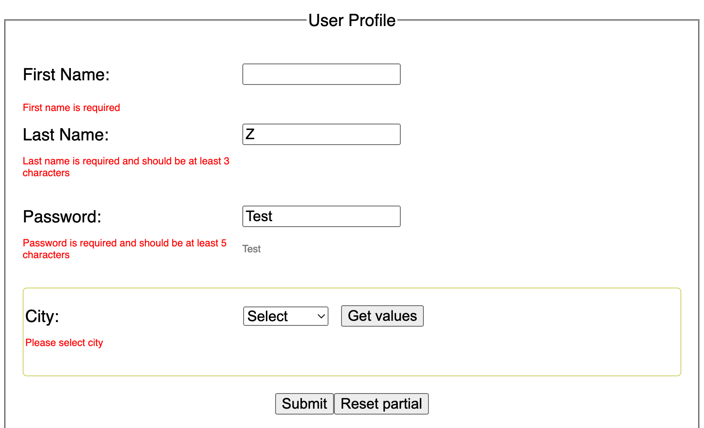
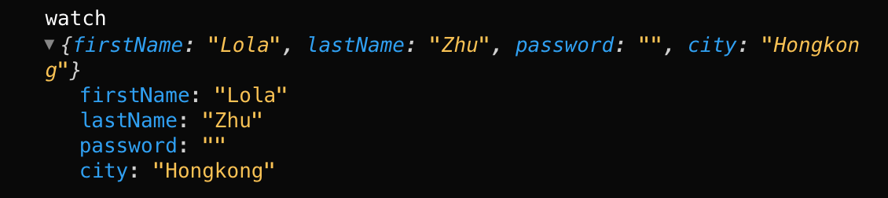
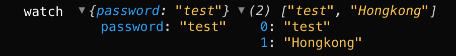

# React-Hook-Form Library | Common use cases

💥 Because absolutely nobody likes to create & rebuild complex forms with validation, I created some common use cases with the example below 👇

The form contains username, password as input fields and city as select field:


Usually we handle simply form directly using Controlled Form by React,

```jsx
useState, useEffect ...
```

However, in complex forms, the more fields that need to be added to the form, the more handlers and states need to be created. This would increase the length of code and add to its unreadability.

[**React Hook Form library**](https://react-hook-form.com/) prevents something like that

🦋 _React Hook Form is a tiny library without any dependencies, it minimizes validate computation, reduces the amount of code while removing unnecessary re-renders, and can be easily adopted without other dependencies._

<hr />

## Use react-hook-form:

- Import and call the <span style='color:pink;font-size:18px'>useForm </span>hook.

_\*Set up the form management and state that will be shared between all fields linked to the form. useForm returns an <span style='color:yellow;font-size:18px'>object </span>which contains useful functions ( register, setValue, getValues, handleSubmit… )._

- Involk <span style='color:pink;font-size:18px'>register</span>

_\*Register is a callback function which returns some props and inject into the inputs so that we can taking control and reading the inputs, it allows us to connect an input to the form defined by useForm(), it returns 4 important attributes:_

```jsx
onChange; // prop to subscribe the input change event.

onBlur; // prop to subscribe the input blur event.

ref; // Input reference for hook form to register.

name; // Input’s name being registered.
```

```jsx
<form onSubmit={...}>
  <input {...register("firstName")} />
  <input type="submit" value="Submit" />
</form>
)}
```

- Perform <span style='color:pink;font-size:18px'>validation </span>

  \*_The validation can be defined by passing an object with the require rules to the register function as a parameter._

```jsx
// firstName validation
<input {...register("firstName",
  {
    required: "First name is required"
  })} />

// lastName validation
<input {...register("lastName",
    {
      required: true,
      minLength: {
        value: 3,
        message: "Last name is required and should be at least 3 characters"
      }
    }
  )} />
```

👉 In this process, validation will be performed first, and this involves checking the validation rules defined in the register function. ( required message, minLength … )

🎈 Notice that there is NO re-render at all, but we have focus on the right input ( firstName input field ) after submit, which actually causes the validation error.

👉 This is because rendering in react-hook-form is handled fairly well, if we don’t subscribe to the error states, it won’t trigger a re-render!

- Subscribe to errors, use <span style='color:pink;font-size:18px'>formState </span>

```jsx
const { register, handleSubmit, formState: { errors }} = useForm();
<input {...register("lastName", {...})} />

<p>{errors.lastName?.message}</p>
```

- Provide <span style='color:pink;font-size:18px'>defaultValues </span>at useForm

_defaultValues for inputs are used as the initial value when a component is first rendered, before a user interacts with it._

```jsx
const defaultValues = {
          firstName: 'Lola',
          lastName: 'Zhu',
          password: '',
          city: 'Hongkong'
      };
const {...} = useForm({ defaultValues });
```

- Set the <span style='color:pink;font-size:18px'>mode </span>of the form

\*_control the timing of triggering the verification. If we want the user to perceive the error as soon as possible, we can use “all”:_

```jsx
const {...} = useForm({
    defaultValues,
    mode: "all" // 👉 onChange | onBlur | onSubmit | onTouched | all
});
```

- Subscribe to some certain input value, use <span style='color:pink;font-size:18px'>watch API</span>.

\*_watch specified inputs and return their values. It is useful to render input value and for determining what to render by condition._

```jsx
const { ..., watch } = useForm({ ... });
// By default, typing in the input, the react-hook-form doesn’t trigger any re-render, but by calling the watch function, we can subscribe to the input


//“watch” specified inputs and return their values:
const password_value = watch();
const watchFields = watch(['password', 'city']);
```




👉 Watch will trigger <span style='color:red;font-size:18px'>re-renders</span> at the root of the application or form, consider using a callback or the <span style='color:yellow;font-size:18px'>useWatch API </span>if you are experiencing performance issues.

- Use <span style='color:pink;font-size:18px'>getValues </span>helper API for reading input values, the difference between watch and getValues is that getValues will not trigger re-renders or subscribe to input changes.

```jsx
// { firstName:"Lola",lastName:"Zhu",password:"...",city:"Hongkong"}
getValues();
// "Hongkong"
getValues('city');
// ["Lola","Zhu","Hongkong"]
getValues(['firstName', 'lastName', 'city']);
```

- <span style='color:pink;font-size:18px'>useFormContext </span>,it acts very similar to React’s useContext.

\*_useFormContext is intended to be used in deeply nested structures, it allows us to access the form context, get the form methods and states provided by useForm without having to call the hook again._

use <span style='color:yellow;font-size:18px'>FormProvider </span>wrapper at the level where form data will be sent to children and grand-child, and access them with <span style='color:yellow;font-size:18px'>useFormContext </span>hook.

```jsx
// import FormProvider
import { useForm, FormProvider } from "react-hook-form";

export default function App() {
const { register, getValues} = useForm();
return (
  <FormProvider {...{register, getValues}}>
    <form>
      <Country />
    </form>
  </FormProvider>
)}

// Retrieve all hook methods with useFormContext
import { useFormContext } from "react-hook-form";

const Country = () => {
// retrieve hook methods
 const {register, getValues} = useFormContext();
    return (
      <>
        <select {...register("city", { required: "Please select city" })}>
        <option value="Hongkong">Hongkong</option>
        <option value="Shanghai">Shanghai</option>
        </select>
        <button type="button" onClick={() => getValues()}>
        Get values</button>
    </>
)};
export default Country;
```

- Use <span style='color:pink;font-size:18px'>reset API </span>

🍭 _There are many different cases how user wants to reset the form. For example, sometimes we want to reset the form to the initial state or reset / update state, or reset the form with some partial values…. etc._

👉 First case: reset form to <span style='color:yellow;font-size:18px'>initial</span> state.

_The first argument that reset provides is actually optional, that means if we execute the function without any parameters ( reset() ), react-hook-form will reset the form back to default value what you provide. When defaultValues is not supplied, then HTML native reset API will be invoked to restore the form._

```jsx
  const { ...,reset } = useForm();
  const resetForm = () => reset();
```

👉 Second case: <span style='color:yellow;font-size:18px'>reset and update </span>form value

_If we want to reset entire form into a different value, but also update default value, then we can supply with value. When the value gets provided, after click on reset button, not only the value in the UI will be updated, but also our defaultValue which stored inside react-hook-form will be reflected, in our code below, after reset, city will be “Shanghai” instead default “Hongkong”._

```jsx
const resetForm = () => {
reset((formValues) => ({
…formValues,
city: “Shanghai”
}));
}
```

👉 Third case: grab everything and <span style='color:yellow;font-size:18px'>partially </span>reset form.

_We can combine the getValues API, this means we can do Shallow Merging with what is actually current in the form and merge the value we want to apply_

- In this case, the other input values remain the same, but the firstName is reset to “Mini”\*

```jsx
const resetForm = () => {
	reset({
		...getValues,
		firstName: 'Mini',
	});
};
```

<hr />

There are many more custom hooks ( e.g. useController, useWatch, useFormState, useFieldArray ), and many more methods ( e.g. setFocus, getFieldState, resetField, setValue … etc ).
