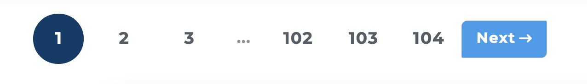
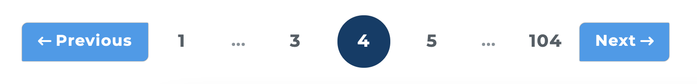
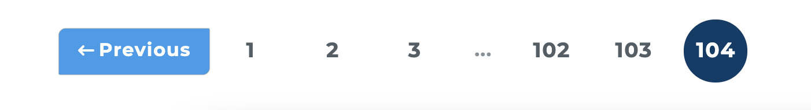

# Pagination with React





Parent component:

```jsx
const ParentComponent = () => {
  const [pageResult, setPageResult] = useState({});

  // first render page 1
   useEffect(() => {
     async function fetchTrial() {
       const data = await Client.trialPageList.get(1);
       setPageResult(data);
     }
     fetchTrial();
    }, []);

  // fetch page from Pagination Component
  const fetchPageData = async (page) => {
    const result = await Client.trialPageList.get(page);
    setPageResult(result);
  };

  const pageTotal = pageResult?.meta?.last_page;
  const currentPage = pageResult?.meta?.current_page;
  const buttonLinks = pageResult?.meta?.links;


  return ...

  <Pagination
    pageTotal={pageTotal}
    currentPage={currentPage}
    buttonLinks={buttonLinks}
    fetchPageData={fetchPageData}
   />
   ...
}
```

Pagination Component

```jsx
const Pagination = ({ fetchPageData, pageTotal, currentPage, buttonLinks }) => {
  return (
    <div className={styles.pagination}>

     // should only visible if current page >= 4
      {currentPage >= 4 && (
        <Button
          onClick={() => fetchPageData(String(currentPage - 1))}
          className={classNames(styles.activeBtn, {
            [styles.invisible]: currentPage === 1,
          })}
          theme="pagination"
        >
          <Image src={smallArrowLongLeft} />
          Previous
        </Button>
      )}

     // the first 3 buttons should be visible if the current page <=3
     // or >= total - 2 (last three buttons visible)
      <Button
        className={classNames(styles.circle, {
          [styles.activeButton]: currentPage === 1,
        })}
        onClick={() => {
          fetchPageData(1);
        }}
        shape="bubble"
      >
        1
      </Button>

      {(currentPage <= 3 || currentPage >= pageTotal - 2) && (
        <Button
          className={classNames(styles.circle, {
            [styles.activeButton]: currentPage === 2,
          })}
          onClick={() => {
            fetchPageData(2);
          }}
          shape="bubble"
        >
          2
        </Button>
      )}

      {(currentPage <= 3 || currentPage >= pageTotal - 2) && (
        <Button
          className={classNames(styles.circle, {
            [styles.activeButton]: currentPage === 3,
          })}
          onClick={() => {
            fetchPageData(3);
          }}
          shape="bubble"
        >
          3
        </Button>
      )}


     // should only visible if the current page >= 4
      {currentPage >= 4 && (
        <Button className={styles.dots} disabled>
          ...
        </Button>
      )}

     // filter out three buttons for the pages >= 4 or <= total -3
      {buttonLinks
        ?.filter(
          (item) =>
            item.label === String(currentPage) ||
            item.label === String(currentPage - 1) ||
            item.label === String(currentPage + 1),
        )
        .map((btn) => {
          return (
            currentPage >= 4 &&
            currentPage <= pageTotal - 3 && (
              <Button
                key={btn.label}
                onClick={() => {
                  fetchPageData(btn.label);
                }}
                className={classNames(styles.circle, {
                  [styles.activeButton]: btn.label === String(currentPage),
                })}
                disabled={btn.label === '...'}
                shape="bubble"
              >
                {btn.label}
              </Button>
            )
          );
        })}

      // should only visible if the last three buttons are visible
      {currentPage <= pageTotal - 2 && (
        <Button className={styles.dots} disabled>
          ...
        </Button>
      )}

      // the last three buttons if the current page < 4 or >= total - 2
      {(currentPage >= pageTotal - 2 || currentPage < 4) && (
        <Button
          className={classNames(styles.circle, {
            [styles.activeButton]: currentPage === pageTotal - 2,
          })}
          onClick={() => {
            fetchPageData(String(pageTotal));
          }}
          shape="bubble"
        >
          {String(pageTotal - 2)}
        </Button>
      )}
      {(currentPage >= pageTotal - 2 || currentPage < 4) && (
        <Button
          className={classNames(styles.circle, {
            [styles.activeButton]: currentPage === pageTotal - 1,
          })}
          onClick={() => {
            fetchPageData(String(pageTotal));
          }}
          shape="bubble"
        >
          {String(pageTotal - 1)}
        </Button>
      )}
      <Button
        className={classNames(styles.circle, {
          [styles.activeButton]: currentPage === pageTotal,
        })}
        onClick={() => {
          fetchPageData(String(pageTotal));
        }}
        shape="bubble"
      >
        {String(pageTotal)}
      </Button>

      // should always be visible if the current page is not the last one
      {currentPage !== pageTotal && (
        <Button
          onClick={() => fetchPageData(currentPage + 1)}
          className={styles.activeBtn}
          theme="pagination"
          disabled={currentPage === pageTotal}
        >
          Next
          <Image src={smallArrowLongRight} />
        </Button>
      )}
    </div>
  );
};

export default Pagination;
```
