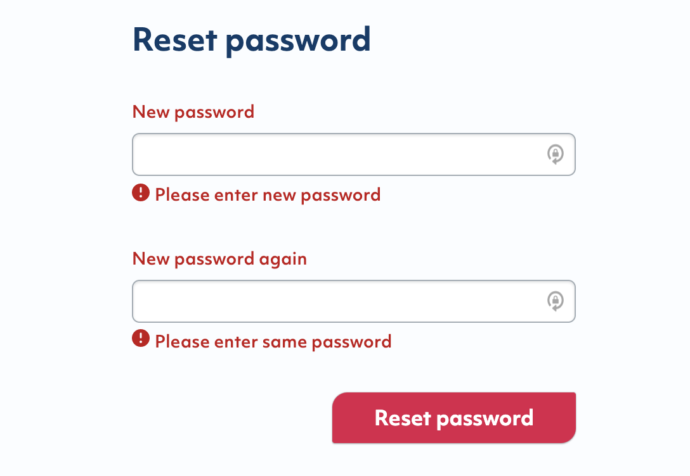
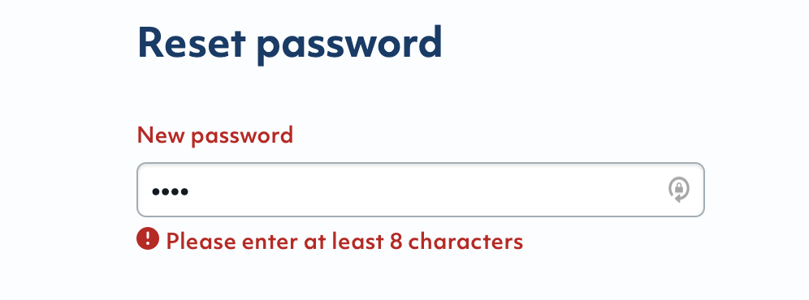

# Password validation with Reakit

In my current project, I need to create a simple password reset form which User can enter neu password and confirm it.

🦋 Since we will also do validation on backend, so for the frontend we only need that the password
_contains at least 8 characters_.

<hr />

I'm using [Reakit Form](https://reakit.io/docs/form/) because it is an accessible component with a collection of other components, and Reakit is a lower level component library for building accessible high level UI libraries, design systems and applications with React.

<hr />

Here are the Steps that I did:

🌸 First, create the input fields ( using our company component )

```jsx
<div className={styles.resetInputField}>
	<InputField type="password" name="password" label="New password" {...form} />
	<FormMessage {...form} name="password" className={styles.errorMessage} />
</div>
```

🌸 Second, create the simple password validation for **at least 8 characters**

```jsx
const passwordValidateValue = /^.{8,}$/; // Don't forget the "," after 8
const passwordValidate = (value) => {
	return passwordValidateValue.test(value);
};
```

🌸 Bind them into Reakit Form

```jsx
const form = useFormState({
	values: {
		password: '',
		password_confirmation: '',
	},
	onValidate: (values) => {
		let errors = {};
		// First validation: if User doesn't enter any character, error should appear
		if (!values.password) {
			errors = {
				...errors,
				password: renderInputErrorFor('new password'), // here is a render error function which is defined outside this file, it prints dynamic result out: "Please enter {value}" => in this case {value} is 'new password' param
			};
		}
    // Second validation: confirm password should be same as password
    if (values.password_confirmation!==values.password) {
			errors = {
				...errors,
				password: renderInputErrorFor('same password'), // same like above, in this case {value} is 'same password' param
			};
		}
		// Third validation: password should exist and have at least 8 characters
		if (!passwordValidate(values.password) && values.password) {
			errors = {
				...errors,
				password: renderInputErrorFor('at least 8 characters'), // same like above, in this case {value} is 'at least 8 characters' param
			};
		}
	},
});
... // Add Reset password Button somewhere
```

For the Reset password Button we can use Reakit FormSubmitButton 👇

```jsx
import { unstable_FormSubmitButton as FormSubmitButton } from 'reakit/Form';
```

🌟 That's it! Result below:




