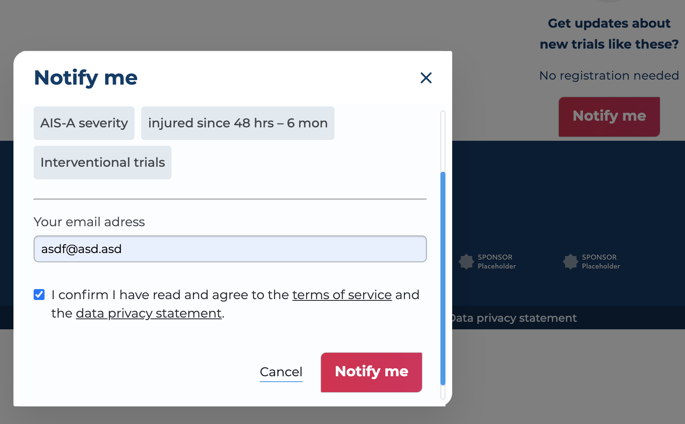

# Prevent Dialog validateDOMNesting `<button>` descendant error

Currently in my Project, I need to create an `form Dialog` as Overlay which contains a basic `input form` and some other items, within this Overlay I have a Button again which is clickable and is able to open an other `email Confirm` Overlay Dialog.




The red button is from my Button Component which is using [Reakit](https://reakit.io/docs/get-started/):

```jsx
import styles from '../Button/Button.module.scss';
import PropTypes from 'prop-types';
import React from 'react';
import classNames from 'classnames';
import { Button as BaseButton } from 'reakit/Button';

const Button = React.forwardRef(
	({ children, shape, className, disabled, ...other }, ref) => (
		<BaseButton
			className={classNames(
				className,
				styles[shape],
				// ...
				{
					[styles.disabled]: disabled,
				},
			)}
			disabled={disabled}
			ref={ref}
			{...other}
		>
			{children}
		</BaseButton>
	),
);

Button.propTypes = {
	children: PropTypes.node.isRequired,
	className: PropTypes.string,
	shape: PropTypes.oneOf(['bubble', 'default']),
};
Button.defaultProps = {
	shape: 'default',
	className: null,
};

export default Button;
```

And I created the overlay Dialog with [Reakit disclosure](https://reakit.io/docs/disclosure/) similar like below:👇

```jsx
import { useDialogState, DialogDisclosure } from 'reakit/Dialog';
import Button from 'components/Button/Button';
import Modal from 'components/Modal/Modal';

const Overlay = () => {
	const dialog = useDialogState();
	return (
		<>
			<DialogDisclosure {...dialog}>
				<Button>Notify me</Button>
			</DialogDisclosure>
			<Modal>Confirm Content ... </Modal>
		</>
	);
};
// ...
```

💥 It works fine, but I noticed in the console that an Error exists actually: `validateDOMNesting(…): <button> cannot appear as a descendant of <button>`

After a series of checks, I found the reason:

**The default `DialogDisclosure` uses `Disclosure`, and is used by `PopoverDisclosure` and its derivatives, and `Disclosure` uses 👉 `BUTTON`.**

🧚 That means:

In the Overlay, `DialogDisclosure` is already nested in a `Button Component` which hence the error, just wrapp the Button inside DialogDisclosure is not the best way, although it does not affect the operation of the code.

My Solution: 🍭

Created a simple `Button-like` Component and use it instead of `Button` within the DialogDisclosure 👇

```jsx
import styles from 'components/NotifyOverlayButton/NotifyOverlayButton.module.scss';
import React from 'react';

const NotifyOverlayButton = ({ children, ...other }) => {
	return (
		<div className={styles.notifyOverlayButton} {...other}>
			{children}
		</div>
	);
};

export default NotifyOverlayButton;
```

```jsx
// scss for NotifyOverlayButton:
@import 'assets/styles/variables';

.notifyOverlayButton {

width: fit-content;
height: fit-content;
color: $white;
background: linear-gradient(90deg, #df1a4b 0%, #dc1d5b 100%);
box-shadow: 0 0 1px $color-gray-80;
border-radius: rem(6px) rem(1px);
padding: rem(10px) space('100') space('75');
font-weight: font-weight(semi);

border-style: none;
span {
text-transform: initial;
@include media-breakpoint-up(md) {
font-size: rem(17px);
}
}

&:focus,
&:hover {
outline: none;
}
}
```

```jsx
// in Overlay component import and use it
<NotifyOverlayButton onClick={handleSubmit}>
	<span className={styles.notifyMe}>Notify me</span>
</NotifyOverlayButton>
```
