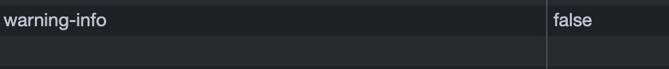

# Use session storage to persist state (React)

In the project I am working on, I created a small React Component which is a very simple banner, it contains an icon, text content and different background colors, all of these can be changed by editorial users themselves using CMS, and it also contains a close button.


<hr />

As mentioned above, this Banner Component is very simple, however we found that when you close the banner and refresh the page, the banner appears again 💥

Ok, now the point is to prevent this phenomenon, I thought of using simple but classic React solution with native **local storage** or **session storage** to persist this appearance state. ✂️

<hr />

But which one is better in this case? After researching some sources, I came to this conclusion 👇

🌸 The read-only **sessionStorage** property accesses a session Storage object for the current origin, it is similar to **localStorage**; the difference is that while data in localStorage doesn't expire, data in sessionStorage is cleared when the page session ends.

In my case, what I actually needed is **session storage**, because there is no important data, and I don't want to store and retrieve them during JavaScript application again and again.

<hr />

Here are the Steps:

1. Create a **useSessionStorage** storageHook 🧚‍♂️

```jsx
/*- Hooks into sessionStorage. The value will be taken from sessionStorage, if the key exists there.
- If not, the value will use the `initialValue` data. Use the setFunction to update the value inside

- @param {string} key
- @param {\*} initialValue
- @returns {Array} [value, setFunction]
*/
export const useSessionStorage = (key, initialValue) => {
	let defaultValue;
	try {
		defaultValue = sessionStorage.getItem(key)
			? JSON.parse(sessionStorage.getItem(key))
			: initialValue;
	} catch (e) {
		defaultValue = initialValue;
	}
	const [value, setValue] = useState(defaultValue);

	return [
		value,
		(newValue) => {
			sessionStorage.setItem(key, JSON.stringify(newValue));
		},
	];
};
```

2. Create this tiny Banner Component and use this Hook 🧚‍♂️

```jsx
const CmsBanner = ({ details, color, icon, bannerId }) => {
	const [storage, setStorage] = useSessionStorage(bannerId, true); // bannerId ("warning-info") as key
	if (!storage) {
		return null;
	}
	const handleClose = () => {
		setStorage(false);
	};
	return (
		<Container>
			<Banner // from design system, out of scope
				details={details} // cms block variables as frontend props, out of scope
				color={color}
				handleClose={handleClose}
				fontAwesomeIcon={icon}
			/>
		</Container>
	);
};
```

That's it! Click on the close button, the session storage value will be set to "false", with this lines below, even if you refresh the page, the banner will not appear again ✨

```jsx
if (!storage) {
	return null;
}
```


