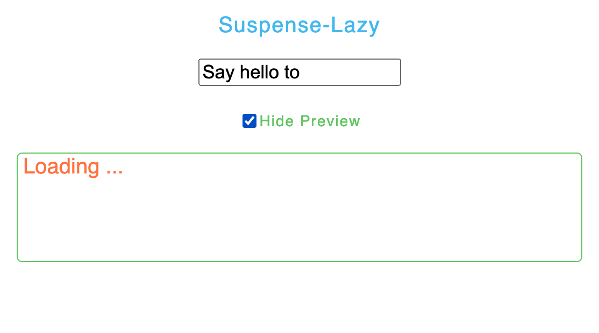
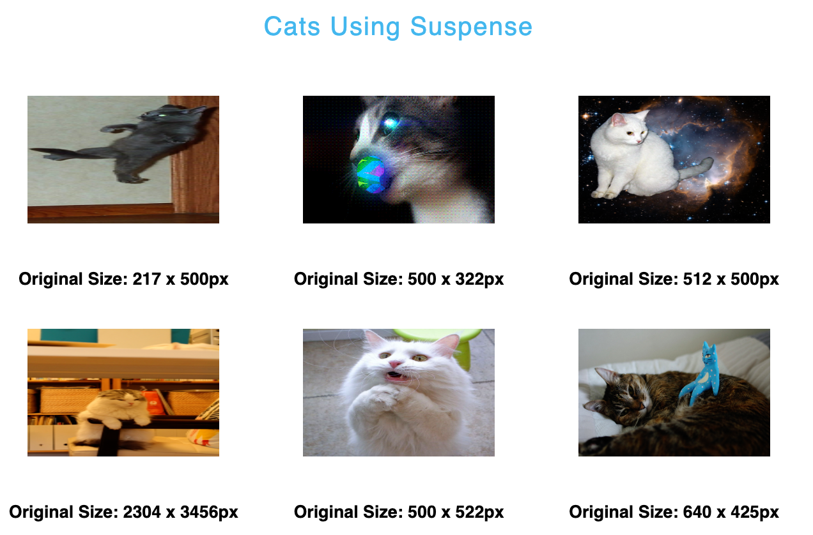

# Suspense with Lazy | Axios

Suspense lets your components wait⏰ for something before they can render “safely”.

It is like _try…catch_, deciding whether the UI is “safe”, show some fallback while is loading, and show “safe” components when it’s done.

```jsx
try {
	// things are not ready yet
} catch {
	// immediately enter the catch block, show fallback
}
```

In order to show some loading status we could do conditional rendering like we usually do👇

```jsx
function ParentComponent() {
	const [data, setData] = useState(null);
	useEffect(() => {
		fetchData().then((res) => setData(res));
	}, []);
	if (data === null) {
		return <LoadingSpinner1 />;
	}
	return (
		<>
			<h1>{data.heading}</h1>
			<ChildComponent />
		</>
	);
}

function ChildComponent() {
	const [otherData, setOtherData] = useState(null);
	useEffect(() => {
		fetchOtherData().then((res) => setOtherData(res));
	}, []);
	return <>{otherData === null ? <LoadingSpinner2 /> : otherData}</>;
}
```

It works great, but this is what the above code actually says:

- Start fetching data
- Show LoadingSpinner1, then the heading and then wait …
- Finish fetching data
- Start fetching otherData
- Show LoadingSpinner2, then wait …
- Finish fetching otherData
- Done

This is a waterfall effect, we should not wait for the response, that means we should fetching both code and data at the same time, deal with asynchronous operations, promises.

👉 Suspense is to solve asynchronous operations, not just display content of the component.

In general, Suspense is divided into two functions: <span style='color:pink;font-size:18px'>asynchronously loading code ( code splitting ) </span>and <span style='color:pink;font-size:18px'>asynchronously loading data</span>.

<hr />

First example: asynchronously loading **CODE** with Suspense and lazy API ( dynamic import component).

📌 The lazy API is a method provided by React to lazy load components ( dynamically import ), it takes a parameter and wraps it as a react component.

```jsx
Promise<() => {default: ReactComponent}>
```

ReactComponent can be any types of components,

```jsx
const Lazy = lazy(() => import("./LazyComponent"))
<Suspense fallback={<div>Loading ...</div>}>
<Lazy/>
</Suspense>
```

Since Lazy is often loaded from a remote location, it seems that dynamic import is similar to a Promise, it also has three states ( Pending, Resolved, Rejected ).

👉 Here comes Suspense, which indicates what content should be displayed during the loading process. When the loading is complete, Suspense will switch the fallback to the content of the Lazy component.

In this example, user can type in the input field and preview the text by checking the “Show Preview” checkbox. Here, the code for Preview won’t be loaded until the checkbox is checked, if Preview hasn’t loaded yet, “Loading …” will be shown in its place.



In the code below, I used setTimeout on the Preview component to “fake” a long loading time ( 2 seconds ) in order to see how the loading fallback renders.👇

```jsx
import { useState, Suspense, lazy } from "react";
import InputField from "./components/InputField";

// 🔴 dynamic import and fake "delay" Preview
const Preview = lazy(async() => {
  return new Promise((resolve, reject) => {
      setTimeout(() => resolve(), 2000)
    })
      .then(() => import("./components/Preview"))
      .catch((e) => console.log(e))
});
const SuspenseLazy = () => {
const [inputValue, setInputValue] = useState("Say hello to");
const [showPreview, setShowPreview] = useState(false);
return (
  <>
    <p>Suspense-Lazy</p>
    <InputField
          inputValue={inputValue}
          showPreview={showPreview}
          setShowPreview={setShowPreview}
          setInputValue={setInputValue}/>
    {showPreview && (
        <Suspense fallback={<div>Loading ...</div>}>
            <Preview inputValue={inputValue} />
        </Suspense>
    )}
  </>
)};

export default SuspenseLazy;

export default function InputField(props) {
  const {showPreview, inputValue, setShowPreview, setInputValue} = props;
  return (
    <>
      <input
          value={inputValue}
          type="text"
          onChange={(e) => setInputValue(e.target.value)} />
      <input
          type="checkbox"
          onChange={() => setShowPreview(!showPreview)}
          checked={showPreview} />
      <label>{!showPreview ? "Show Preview" : "Hide Preview"}</label>
    </>
)}
```

In this way, code loading is an asynchronous process, the entire loading state does not need to be controlled by the developer.

💥 Although Suspense is often used with lazy, can Suspense only be used with lazy? Does lazy have to cooperate with Suspense? Well, let’s say, Suspense is a standard for loading data, Lazy is a method implemented under this standard. 📌 This means that lazy cannot be used without Suspense.

<hr />

Second example: asynchronously loading data with Suspense and Axios.




Suspense requires the code to be suspended, that is, throw a catchable Promise exception, and render the component after the Promise ends.

❗️ \*If we wrap the components without Promise with Suspense, it is possible that nothing happens, because Suspense needs the children’s Promise to be triggered, and then returns the result and renders the children.

This means if we want to use Suspense, we need to do something with its children components.

- There must be a Promise in the children component.
- The Promise of the children component should be thrown in the pending state for Suspense.
- After the Promise succeeds, Suspense will re-render the children component.
- The re-rendered children component will no longer execute the Promise because the data is cached.
- After all above steps, you can wrap Suspense on your components to display fallback.

Here I’m simply going to have a component that needs to fetch some cats, let’s create axios fetch request first:

```jsx
import axios from 'axios';
export async function fetchCats() {
	return axios
		.get('https://...')
		.then((res) => res.data)
		.catch((err) => console.log(err));
}
```

As mentioned above, we need to throw a Promise exception if our component is loading or failing, and then return the response when the Promise is successfully resolved.

In our case, fetchCats will be a promise, now we need to “wrap” it, “check” the promise’s state then “return” a response object compatible with suspense and export it:

```jsx
export default function fetchAllCatsData() {
  const catsPromise = fetchCats;
    return {
        data: wrapPromise(catsPromise)
    }}

export function wrapPromise(promise) {
    let status = "pending";
    let result;
    let suspend = promise().then((res) => {
        status = "success";
        result = res;
      }, (err) => {
        status = "error";
        result = err;
    });
    return {
        👉read() {
          // let suspense catch the error and return the fallback
          if (status === "pending") {
            throw suspend;
        } else if (status === "error") {
            throw result;
        }
          // change fallback to content when value is returned
          else if (status === "success") {
            return result;
      }}}}
```

The code above will check the promise’s state, then return a function called read which we’ll invoke later in our component with _fetchAllCatsData()_.

❗️ Note that the read method must be used, otherwise it will throw an error.

Our component code:

```jsx
import { Suspense, lazy } from "react";
import fetchAllCatsData from "./fetchAllCatsData";

const resource = fetchAllCatsData(); // 👉use data
const LazyCatsUsingSuspense = lazy(async() => {
    ... // same as first example
    .then(() => import("./components/CatsUsingSuspense"))
  });

const SuspenseFetch = () => {
    return (
      <Suspense fallback={<h1>Loading cats...</h1>}>
        <LazyCatsUsingSuspense fetchedResource={resource.data} />
      </Suspense>
  )};

function CatsUsingSuspense({fetchedResource}){
    return (
      <>
        {fetchedResource.read().map(({ url, id, width, height }) => {
          return (
            <div key={id}>
                
          );
        })}
      </>
    )}
```

That’s it! 🍄 You’ll see “Loading cats…” before the images appear, 👉 the data will be cached, to see the loading state again, refresh the page.

Summary, the parts of using Suspense:

- Import Suspense
- Wrap the component that is fetching data with Suspense
- Until that data is resolved, it will render the fallback
- Render your component

We can try to use Suspense in some cases instead of useEffect, which can sometimes cause headaches. 👐
