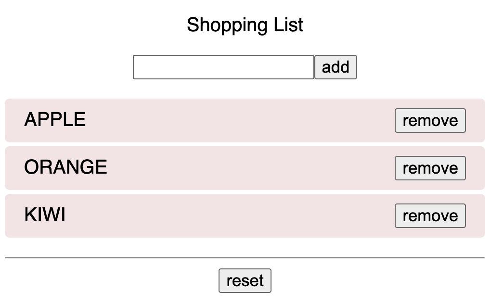

# React Hook useReducer

Reducer is a function that takes two parameters — the current state and an action — and returns a new state based on those two parameters.

```jsx
(state, action) => newState;
```

We could understand <span style='color:yellow'>useReducer</span> like this:

🦋 Use a **dispatch type** to trigger an **action** and update the initial state to a **new state**.

<hr />

### Shopping list Example



- In order to receive newState, we need initial state

```jsx
const initialState = [{ id: '', content: '' }];
```

- ADD a new list

```jsx
const reducer = (state, action) => {
	switch (action.type) {
		// return a new list
		case 'ADD':
			return [...state, { id: state.length, content: action.content }];
		default:
			throw new Error();
	}
};
```

- use the reducer

```jsx
// dispatch action from the reducer, update initial list and return new list
const [newList, dispatch] = useReducer(reducer, initialState);

const addList = () => {
  dispatch({ type: "ADD", content: inputRef.current.value })};

return (
   <AddWrapper addList={addList} ref={inputRef} newList={newList}/>
   ...
 )
```

- pass props down

```jsx
const AddWrapper = ({ addList, newList }, ref) => {
	...
	return (
		<>
			<input ref={ref} />
			<button onClick={addList}>Add</button>
			// new list here...
		</>
	);
};
export default forwardRef(AddWrapper); // forwardRef on react child component
```
