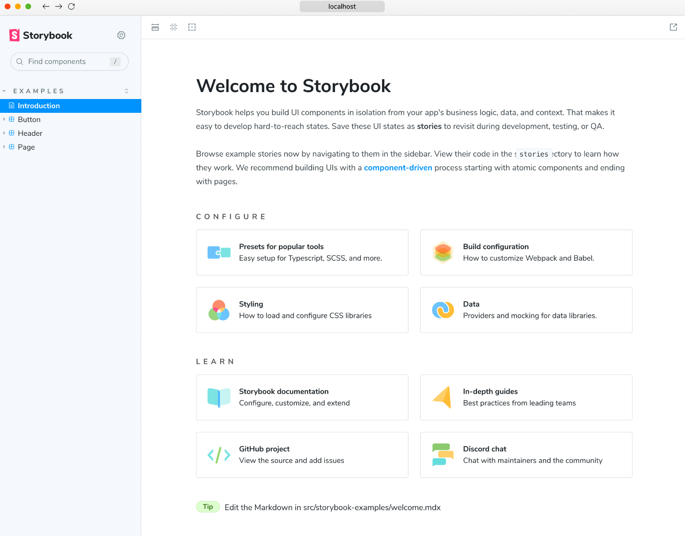
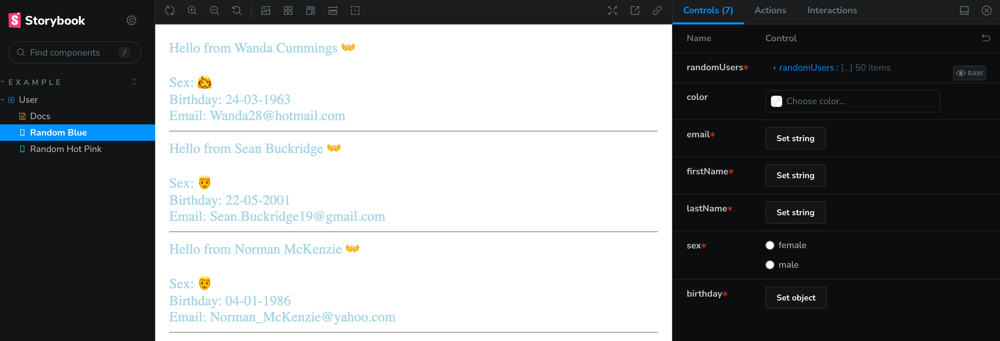
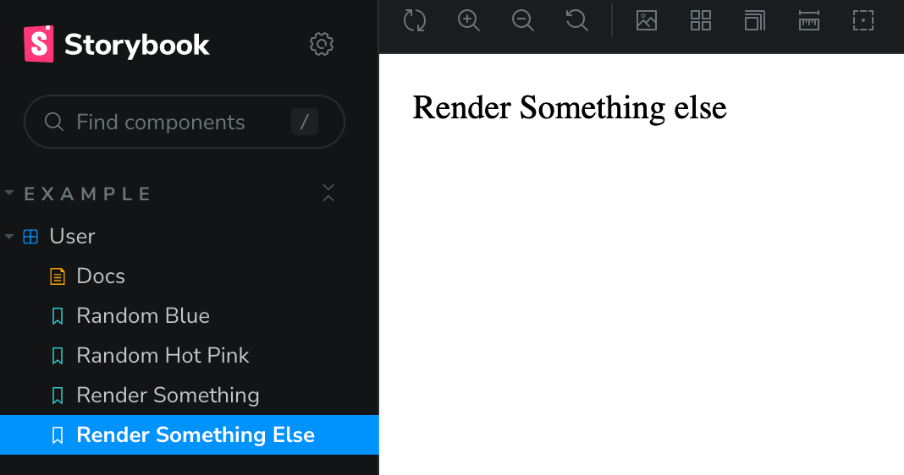
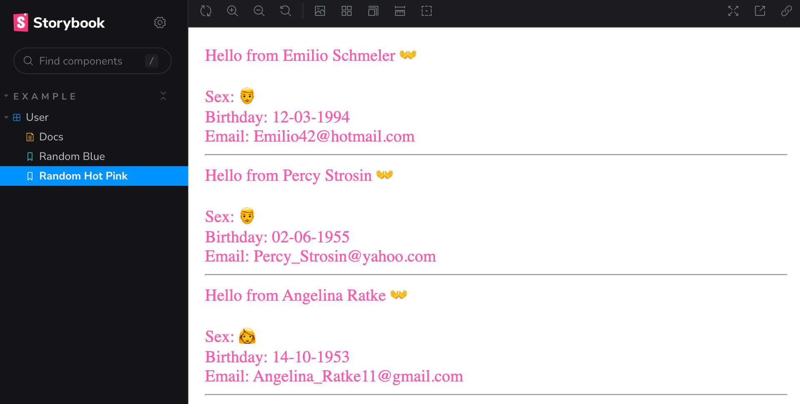

# Storybook | React & Typescript

A frontend workshop for building and testing UI components in isolation, [Storybook](https://storybook.js.org/docs/react/get-started/why-storybook) is more like a sandbox, a tool for building and testing UI components, a story can store the rendering state of a component, and a component can be written and tested with multiple stories. With Storybook we can render a specific variation in isolation by passing in props, mocking data, and we even don’t need to run the whole app.

1. Create a Typescript/React project

```jsx
npx create-react-app your-project-name --template typescript
cd your-project-name
```

2. Add Storybook with this CLI, it will determine what type of project you have (React/Angular, etc.) and install all necessary libraries for your project, including an initial description template.

```jsx
npx sb init
```

3. Now you should be able to run Storybook with the following command:

```jsx
yarn storybook
```



<hr />

## Create stories

1. Create a _RandomUser_ component which shows some random users, [Faker](https://fakerjs.dev/) generates fake data and [date-fns](https://date-fns.org/v2.30.0/docs/format) formats user’s birthday.

```jsx
// User.tsx
import { SexType } from '@faker-js/faker';
import { format } from 'date-fns';
import './User.css';

export interface UserType {
 email: string;
 firstName: string;
 lastName: string;
 sex: SexType;
 birthday: Date;
}
export interface RandomUserType extends UserType {
 randomUsers: UserType[];
 color?: string;
}

export const RandomUser = ({ randomUsers, color }: RandomUserType) => (
 <div className={color === 'hotpink' ? 'pink' : 'blue'}>
  {randomUsers.map(
   ({ email, firstName, lastName, sex, birthday }: UserType) => (
    <>
     Hello from {firstName} {lastName} 👐
     <div>Sex: {sex === 'female' ? '👩' : '👨'}</div>
     <div>Birthday: {format(new Date(birthday), 'dd-MM-yyyy')}</div>
     <div>Email: {email}</div>
     <hr />
    </>
   ),
  )}
 </div>
);

// User.css
.pink {
 color: hotpink;
}
.blue {
 color: lightblue;
}
```

2. Add a file _User.stories.tsx_ alongside the component file, the story file is for development-only, and it won’t be included in your production bundle, e.g 👇

- src
  - stories
    - User.tsx
    - User.stories.tsx
    - User.css;

3. Every component story file consists of a **required** default export and one or more **named** exports.

```jsx
import type { Meta } from '@storybook/react';
import { RandomUser } from './User';

const meta: Meta<typeof RandomUser> = {
	title: 'Example/User',
	component: RandomUser,
};

export default meta;
```

👉 The default export is what we call Meta, the metadata that describes and configures a component, this is the place where we can set the title, which will be shown in the list of stories, or set some extra configuration.

This above is telling Storybook to display **Example/User** in the sidebar, the default export metadata controls how Storybook lists our stories and provides props information used by addons, since our RandomUser has randomUsers( [Array of RandomUser] ) and color( optional ) as props, we’re able to see them in the storybook controls.



4. Add fake data to the component!

```jsx
function createRandomUser() {
	const sex = faker.person.sexType();
	const firstName = faker.person.firstName(sex);
	const lastName = faker.person.lastName();
	const email = faker.internet.email({ firstName, lastName }); //generate personal fake email
	return {
		birthday: faker.date.birthdate(),
		email,
		firstName,
		lastName,
		sex,
	};
}
const randomUsers = faker.helpers.multiple(createRandomUser, {
	count: 50,
});
```

5. 👉 Defining Stories using _named exports_, it is recommended to use UpperCamelCase for your story exports.

   👉 Write stories the similar way you write functions. A story is a function that describes how to render a component, it needs named exports. You can have multiple stories per component, and the simplest way to create stories is to render a component with different arguments multiple times, below is how to render SomeComponent with two exported stories named RenderSomething and RenderSomethingElse

```jsx
const SomeComponent = (args: { label: string }) => <>{args.label}</>;

// 👇 Render functions are a framework specific feature to allow you control on how the component renders.
export const RenderSomething: Story = {
	render: () => <SomeComponent label="Render Something" />,
};
export const RenderSomethingElse: Story = {
	render: () => <SomeComponent label="Render Something else" />,
};
```



That is straightforward for components with few stories BUT can be repetitive with many stories! 👀

6. A better way is to use **args**. A story is a component with a set of arguments that define how the component should render. Args are Storybook’s mechanism for defining those arguments, when an arg’s value changes, the component re-renders. We can introduce args into component’s stories and reduce the amount of code, we can also reuse them via JavaScript object reuse!

```jsx
import type { StoryObj } from '@storybook/react';

type Story = StoryObj<typeof meta>;

export const RandomBlue: Story = {
	args: {
		randomUsers: randomUsers,
	},
};

export const RandomHotPink: Story = {
	args: {
		...RandomBlue.args,
		color: 'hotpink',
		randomUsers: randomUsers.slice(0, 3),
	},
};
```

As shown above, we can spread the RandomBlue story's args into the RandomHotPink stories and reuse them to show the top three users in pink👇



<hr />

☘️ There are much more methods to handle Storybook, for example I was trying to write stories for some components that use [i18next](https://www.i18next.com/), those components need to be wrapped by [Suspense](https://react.dev/reference/react/Suspense) as translation files are lazy loaded. We can wrap stories with extra markup 👉 **Decorators**.

```jsx
// example
import { ComponentMeta, ComponentStory, StoryObj } from '@storybook/react';
import { HeavyComponent } from './HeavyComponent';

export default {
    component: HeavyComponent,
    title: „HeavyComponent“,
    decorators: [
        Story => ( <Suspense fallback="loading..."><Story /></Suspense> ),
    ],
} as ComponentMeta<typeof HeavyComponent>;
```

We can also rename stories, write stories for multiple components, install add-ons, use loaders to fetch API data, etc., in my opinion, the best way is just trying it out 👐
