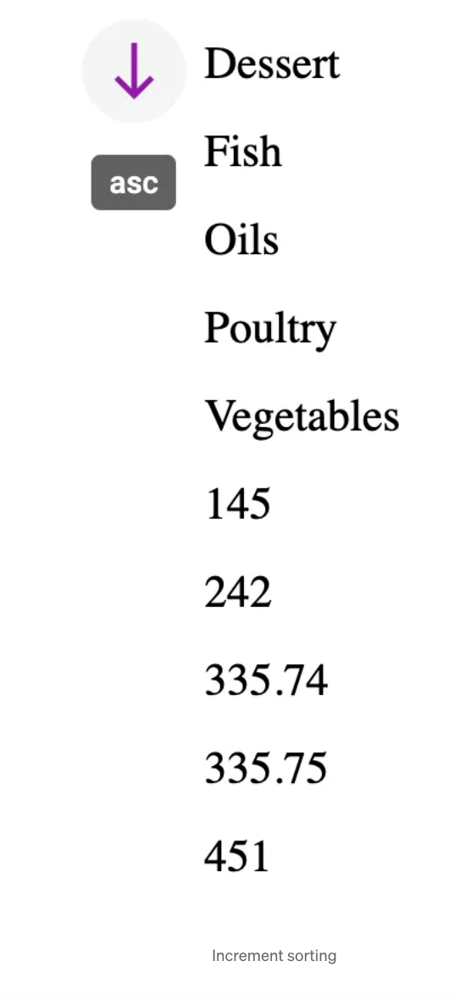

# Sorting with MUI v5 | React & Typescript

This sorting component using some [MUI](https://mui.com/material-ui/getting-started/overview/) supported components, the result should look like this below, click the button and sort the data



Using js sort(), which can sort arrays of numbers and strings without additional parameters, this component contains 2 parts: Sorting button and data

<hr />

1. Sorting button executes the sort action: SortAction, in TypeScript, we need to define types for the component props. As we can see, the component is actually just a clickable arrow icon button that changes direction by className depending on the “order” ( “asc” | “desc” ): 👇

```jsx
type Order = 'asc' | 'desc';

interface SortActionProps {
	onRequestSort: (
		event: MouseEvent<HTMLElement>,
		property: number | string,
	) => void;
	order: Order;
}

const SortAction = (props: SortActionProps) => {
	const { onRequestSort, order } = props;
	const createSortHandler =
		(property: string) => (event: MouseEvent<HTMLElement>) => {
			onRequestSort(event, property);
		};

	return (
		<Tooltip title={order}>
			<IconButton onClick={createSortHandler('categorie')}>
				<NorthSharpIcon
					color="secondary"
					className={order === 'asc' ? classes.sortAsc : ''}
				/>
			</IconButton>
		</Tooltip>
	);
};

// style
sortAsc: {
	transform: 'scaleY(-1)';
}
```

_Here I’m using the MUI component Tooltip which displays informative text when users hover over, focus on, or tap an element, such as a description of its function, here we show the order key ( “asc” | “desc” ) on IconButton hover_.

2. Create the Sort component

```jsx
interface SortProps {
  data: Array<{ [key: string]: string | number }>;
}

export const Sort: FC<SortProps> = ({ data }) => {
  const [order, setOrder] = useState<Order>("asc");

  const handleRequestSort = () => {
    const isAsc = order === "asc";
    setOrder(isAsc ? "desc" : "asc");
  };

  const visibleData = ... // sorted data

  return (
    <>
      <SortAction order={order} onRequestSort={handleRequestSort} />
       <Box>
        {visibleData.map(
          (data: { [x: string]: string | number }, index: number) => (
            <Box key={...}>
              {data["categorie"]} // dumb sorting key from the mock data
            </Box>
          )
        )}
      </Box>
    </>
  );
};
```

3. Create a reusable sorting function “descendingComparator” for the comparison, which accepts the data to sort and a key ( data sorting key which is actually “categorie” in this simple example, I’ll name it “orderBy” ) and returns the compared value👇

ReactComponent can be any types of components,

```jsx
type OderBy = string;

export function descendingComparator<T>(a: T, b: T, orderBy: OderBy) {
	if (b[orderBy] < a[orderBy]) {
		return -1;
	}
	if (b[orderBy] > a[orderBy]) {
		return 1;
	}
	return 0;
}

export function getComparator<T>(
	order: Order,
	orderBy: OderBy,
): (a: T, b: T) => number {
	return order === 'desc'
		? (a, b) => descendingComparator < T > (a, b, orderBy)
		: (a, b) => -descendingComparator < T > (a, b, orderBy);
}
```

```jsx
const visibleData = data.slice().sort(getComparator(order, 'categorie'));
```

🎈*sort() method sorts an array as **strings** by default, the numbers will be converted to strings, for example “1” in “100” is smaller than the “2” in “20”, so while sorting in ascending order, 100 will come before 20. ⚡️ So always pass the compare function otherwise you possibly will get some undesired results.*

🎈 _Notice: sort method doesn’t return a new sorted array, but instead changes the original array, since we don’t want that, we can add a slice method which returns a shallow copy first._
